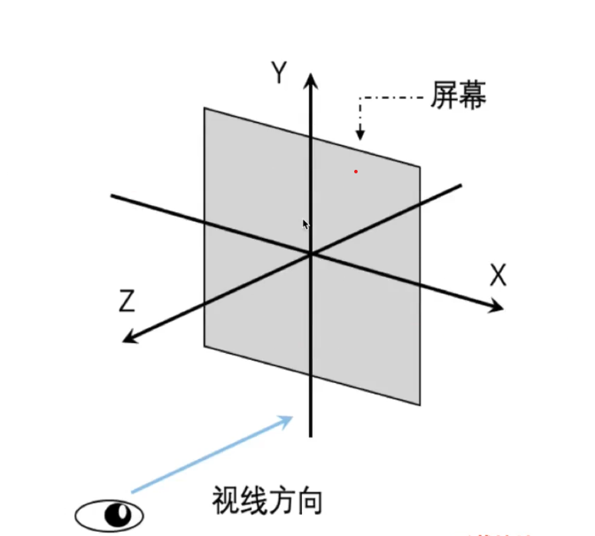

# `WebGL`

`webgl`是一种`3d`绘图协议，衍生于`OpenGL ES2.0`，可以结合`html`、`js`在网页上渲染二维三维图像

## 用途

- 数据可视化
- 图形、游戏引擎
- 地图
- `VR`
- 物品展示
- 室内设计
- 城市规划

## 优势

- 可在浏览器中运行
- 适合前端开发者

## `Canvas`画布

使用`<canvas></canvas>`元素绘制二维和三维的图像

二维图像主要通过 `CanvasRenderingContext2D` 接口完成：`canvas.getContext('2d')`

三维图像主要通过 `CanvasRenderingContext` 接口完成 `canvas.getContext('webgl')`，可以使用`canvas.getContext('webgl2')`获取`2.0`标准的`api`

第一个`webgl`应用，为三维画布重置画布颜色：

<<< @/assets/demos/webgl/重置画布颜色.html{html}

## 着色器（渲染管线）

开发者自行编写的程序，用来代替固定渲染管线，处理图像的渲染。

它以字符串的形式存在在`js`中，被`js`读取后传递给`webgl`

- 顶点着色器：位置
- 片元着色器：像素

创建一个着色器项目初始化代码：

<<< @/assets/demos/webgl/lib/program-init.js

绘制图形：

<<< @/assets/demos/webgl/绘制一个点.html

## 坐标系

二维坐标系：


三维坐标系：




## 着色器`glsl`代码语法

### 变量声明：`attribute`

只在顶点着色器源码中使用，定义：

`attribute vec4 aPosition;`

- `attribute`：存储限定符
- `vec4`：类型
- `aPosition`：变量名

> 分号不可忽略，`aPosition`会被赋值默认值，默认值为中心点。

通过变量修改着色器实现：

<<< @/assets/demos/webgl/顶点着色器-attribute.html

### 变量声明：`uniform`

可以在顶点和片元着色器中使用，但是不能传递给顶点着色器的变量上

`uniform vec4 uColor;`

> 使用方式和`attribute`一样，但是片元着色器和顶点着色器不一样，顶点着色器设置变量时有默认精度，片元着色器没有，需要进行设置。
> `gl_FragColor`固定接收 4 个参数值的`vec4`类型，在使用`uniform vec2`等方式定义变量时需要选择性的将参数值填充到`gl_FragColor`：`gl_FragColor = vec4(uColor.r,uColor.g,0.0,1.0)`

通过变量修改着色器实现：

<<< @/assets/demos/webgl/片元着色器-uniform.html

## 鼠标事件

获取鼠标所在位置的二维坐标：

<<< @/assets/demos/webgl/得到鼠标所在位置.html

## 缓冲区对象

处理多个顶点绘制带来的渲染时机问题，它是一块内存区域，可以一次性将大量顶点数据填充进去缓存起来，供着色器使用

创建和绑定缓冲区对象：

1. 创建缓冲区对象：

```js
const buffer = gl.createBuffer();
```

2. 绑定缓存区对象

```js
gl.bindBuffer(gl.ARRAY_BUFFER, buffer);
```

- `gl.ARRAY_BUFFER`表示缓存顶点数据
- `gl.ELEMENT_ARRAY_BUFFER`表示缓存顶点的索引值

3. 使用类型化数组数据结构创建顶点数据

```js
const points = new Float32Array([-0.5, -0.5, 0.5, -0.5, 0.0, 0.5]);
```

4. 存入数据

```js
gl.bufferData(gl.ARRAY_BUFFER, points, gl.STATIC_DRAW);
```

最后一个参数表示数据的使用方式：

- `gl.STATIC_DRAW`：写入一次，多次绘制
- `gl.STREAM_DRAW`：写入一次，若干次绘制
- `gl.DYNAMIC_DRAW`：写入多次，多次绘制

5. 修改数据

```js
const aPosition  = gl.getAttribLocation(program,'aPosition)
gl.vertexAttribPointer(aPosition,2,gl.FLOAT,false,0,0)
```

[点击查看 `vertexAttribPointer` 参数说明](https://developer.mozilla.org/zh-CN/docs/Web/API/WebGLRenderingContext/vertexAttribPointer)

6. 激活顶点着色器变量

```js
gl.enableVertexAttribArray(aPosition);
```

7. 渲染

```js
gl.drawArrays(gl.POINTS, 0, 3);
```

[点击查看 `drawArrays` 参数说明](https://developer.mozilla.org/zh-CN/docs/Web/API/WebGLRenderingContext/drawArrays)

---


类型化数组：

在`webgl`中，需要处理大量的同类型数据，使用[类型化数组](https://juejin.cn/post/7027259708301901831)可以让程序预知数组元素的类型，提高执行性能

- `Int8Array`：8 位整型
- `UInt8Array`：8 位无符号整型
- `Int16Array`：16 位整型
- `Unit16Array`：16 位无符号整型
- `Int32Array`：32 位整型
- `UInt32Array`：32 位无符号整型
- `Float32Array`：单精度 32 位浮点型
- `Float64Array`：双精度 64 位浮点型

---

多缓冲区
