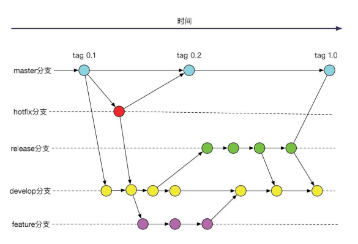

# `git`分支管理

使用 git 进行源代码管理，一般将某个项目的所有分支分为以下几条主线：

## 管理角色

每个仓库的使用者都应该对应一种角色，通常分为两种：

- 开发者
- 管理者

不同的角色使用分支的权限不同，可执行的操作也不同

## 分支说明

### `master` 主分支

存放的应该是随时可供在生产环境中部署的代码，当开发活动告一段落，产生了一份新的可供部署的代码时，`master` 分支上的代码会被更新。同时，每一次更新，都有对应的版本号标签（`TAG`）。

- 提交代码：不可直接更新代码提交，代码来自于 `release` 和 `hotfix` 分支的合并，供发版使用。
- 生命周期：伴随着整个项目的生命周期，项目结束时结束。

### `develop` 开发分支

`develop` 分支是从最新的 `master` 分支派生的共有开发分支，当`master`分支更新时，合并至本分支。当 `develop` 分支上的代码已实现了软件需求说明书中所有的功能并进行了本地调试，派生出 `release` 分支，。

- 提交代码：不可直接更新代码提交，代码来自于 `feature`、`hotfix` 分支的合并，供本地调试`bug`使用。
- 生命周期：从`master`分支派生出本分支时**开始**，本分支派生的`featrue`分支开发完成，合并到本分支后，本分支再派生`release`分支时**结束**。
- 分支命名惯例：`develop`

### `release` 预发布版本分支

发版本前，从 `develop` 分支派生，用于测试开发功能，测试环境中出现的 `bug`，统一在该分支下进行修改，并推送至远程分支。当`release`分支功能测试完毕后合并至`master` 分支，添加版本标签 `tag` 并删除该 `release` 分支。

- 提交代码：所有测试环境出现的`bug`在此分支修复更新
- 生命周期：从`develop`分支派生出本分支时**开始**，完成阶段功能测试并修复所有发现 `bug`，本分支合并至`master`分支时**结束**
- 分支命名惯例：`release/[新版版本号]`，示例：`release/v1.1.0`，

### `feature` 功能分支

在开发一项新的软件功能的时候使用，正常情况开发新功能时从`develop`派生，这个分支上的代码变更最终合并回 `develop` 分支。

例：接到一个开发关于 `cc` 视频点播替换的任务，你需要从 `develop` 分支拉出一个分支，并命名为：`feature/ccVideo-20210820`。然后在该分支下进行开发，开发结束，将该分支合并至 `develop` 分支（此时的代码必须为可运行的，不能影响到他人），合并完成删掉该
分支。

- 提交代码：开发人员的每一个新功能开发都应该在该类分支下进行。
- 生命周期：从`develop`分支派生出本分支时**开始**，完成新功能开发并合并回 `develop` 分支**结束**。
- 分支命名惯例：`feature/[说明]-[日期]`，示例：`feature/cclive-20210820`，若不是需要开发临时功能，可忽略`[临时功能]`

### `hotfix` 修复补丁分支

在 `master` 分支发现 `bug`（所有临时需求视为`bug`） 时，在 `master` 的分支上派生出一个 `hotfix` 分支，修改完成后，合并至 `master` 分支以及 `develop` 分支，合并完成，删除该 `hotfix` 分支。

- 提交代码：任何线上的临时需求或者`bug`在该类分支下进行。
- 生命周期：从 `master` 分支派生 `bug` **开始**，完成 `master` 分支 `bug`分支开发合并回`master`和`develop`时**结束**。
- 分支命名惯例：`hotfix/[说明]-[日期]`，示例：`hotfix/cclivebug-20210820`

综上，

开发人员需要注意两大规则：

- `branch`命名：

  - `feature/`开头代表功能开发
  - `hotfix/`开头代表`bug`修复

- `commit`**言之有物**，简单描述做了什么

开发人员需要操作的分支如下：

- `feature`：开发使用
- `release`：测试中出现的`bug`修改
- `hotfix`：`master`中出现的`bug`修改或`master`中出现的`feature`开发

其它分支一般情况是只会出现合并和派生操作，不能直接提交代码。

> 注：如果项目的参与开发人员不多的话（1-3 人），第 3、4 点是可以省掉的（即不需要开 `feature` 和`release`分支），直接在 `develop` 分支上开发和提测即可。

即：

1. 当一个项目开发人员到达 3 个以上时，使用上述管理方式
2. 当只有 3 个及以下时，只需要创建两个分支`master`、`develop`。所有新功能测试和修复`bug`在`develop`上进行，到达上线条件时合并至`master`，可适当在`master`分支上添加`tag`。

## Git GUI 客户端工具

- [Source Tree（推荐）](https://www.sourcetreeapp.com/) ：[SourceTree 使用教程详解](https://www.cnblogs.com/Can-daydayup/p/13128633.html)

- [Sublime Merge](https://www.sublimemerge.com/)

- [fork](https://git-fork.com/)

- [smartgit](https://www.syntevo.com/smartgit/)

- [GitKraken](https://www.gitkraken.com/)
