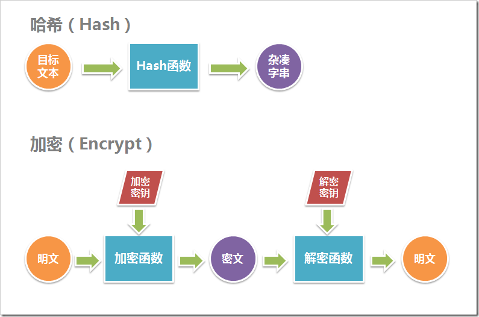

# `crypto` 模块（内置）

## 哈希(`hash`)与加密(`encrypto`)

都是以提高数据安全性为目的的数据处理方式

他们之间的区别：

1. 同一种哈希计算得到的数据长度通常是一样的，而加密得到的数据长度通常与明文长度成正比
2. 哈希算法不可逆，加密算法可逆



**哈希（`Hash`）与加密（`Encrypt`）的选择**

基本原则是：
如果被保护数据仅仅用作比较验证，在以后不需要还原成明文形式，则使用哈希；
如果被保护数据在以后需要被还原成明文，则需要使用加密。

## `crypto` 模块实现哈希和加密

### 哈希

```js
const crypto = require('crypto');

// 创建 MD5 哈希算法，可使用 sha1 等其他算法
const hash = crypto.createHash('md5');

// 对数据进行哈希计算
hash.update('hello world');

// 可重复 update，相当于一个update：hash.update('hello worldhello world')
hash.update('hello world');

// 以16进制的格式得到计算结果
const result = hash.digest('hex');
```

增强哈希

```js
const crypto = require('crypto');

// 需要加入自定义密钥
const hmac = crypto.createHmac('md5', 'screct-key');

// 对数据进行哈希计算
hash.update('hello world');

// 以16进制的格式得到计算结果
const result = hash.digest('hex');
```

### 加密

`aes`实现**对称**加密

```js
const crypto = require('crypto');

// key和iv应为16个字节：(8bit = 1bytes) => (16bytes = 128bit)

// 密钥
const key = '1234567890abcdef';
// 向量
const iv = 'abcdef1234567890';

// 加密数据
function encrypto(key, iv, data) {
  let dep = crypto.createCipheriv('aes-128-cbc', key, iv);

  return dep.update(data, 'binary', 'hex') + dep.final('hex');
}

// 解密数据
function decrypto(key, iv, encryped) {
  let crypted = Buffer.from(encryped, 'hex').toString('binary');
  let dep = crypto.createDecipheriv('aes-128-cbc', key, iv);
  return dep.update(crypted, 'binary', 'utf-8') + dep.final('utf-8');
}

const encryped = encrypto(key, iv, 'hello world');

const decrypted = decrypto(key, iv, encryped);
```
