# 基础架构

## 流程架构

如图所示，架构分为4大阶段：
1. **启动阶段**：对本地环境进行检查，符合运行环境则继续
2. **命令注册阶段**：注册脚手架功能的相关命令
3. **加载命令阶段**：当调用注册的命令时，实时下载该命令的`npm`包并运行
4. **执行阶段**：传入用户输入的参数并执行此命令模块

在第三阶段加载命令阶段优先判断参数是否包含本地模块地址，有则使用本地模块作为命令模块。若不存在则检查是否缓存有此模块，否则下载此模块，最后检查更新模块，进入到第四阶段执行。

## 目录拆分架构

- 核心组：`core`

- 命令组：`commands`
  - 初始化
  - 发布
  - 清除缓存

- 模型组：`models`
  - `command`命令
  - `Project`项目
  - `component`组件
  - `npm`模块
  - `GIT`仓库

- 支撑模块组：`utils`
  - `git`操作
  - 云构建
  - 工具方法
  - `api`请求
  - `git api`

## 拆分原则
根据模块的功能拆分：
- 核心模块：`core`
- 命令模块：`commands`
- 模型模块：`models`
- 工具模块：`utils`

涉及模块技术：

**核心库**：
  - `import-local` ：优先执行本地命令
  - `commander` ： 命令执行

**工具库**：
  - `npmlog` ：打印日志
  - `fs-extra` ：文件操作
  - `semver` ：版本比对
  - `colors` ：命令行文本颜色
  - `user-home` ：用户主目录
  - `dotenv` ：读取用户目录下的`.env`环境变量
  - `root-check` ：是否`root`用户操作
  - `path-exists` : 目录是否存在
  - `minimist` ：格式化命令传入参数
  - `pkg-dir`: 使用此模块得到执行命令的文件所在模块的具体路径，`sync`方法查询指定路径文件的所属模块路径
