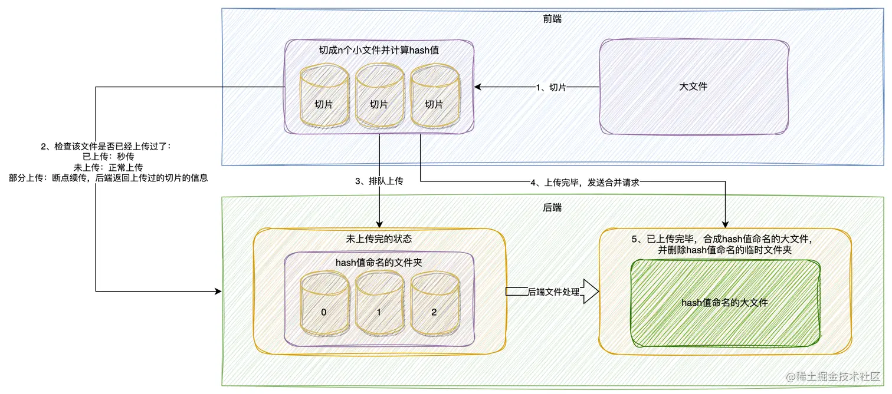

# 文件上传-切片

在上传文件时，网络状态较好的情况下，上传一个1M的文件可能只需要1-5秒，若上传一个100M的文件可能需要1-5分钟。

1M大小的文件上传失败还可以接受，重新上传即可，若上传大文件失败则需要花费更多的时间进行重传，而且大文件更容易失败。

这个时候就需要对大文件切片，将切片一个个上传，即使部分切片失败，再重传时可忽略成功的切片，重传花费的时间就可以大大减少。


## 切片上传架构


## 前端实现

1. 定义分片大小
  ```js
  const file = document.querySelector('input').files[0]
  const M = 1024 * 1024
  const SPLIT_SIZE = M * 10
  // 根据文件大小选择上传方式
  const uploadType = file.size > SPLIT_SIZE ? 'split' : 'all'
  ```

2. 切片
  ```js
  /**
  * @method splitFile
  * @description 对文件进行切片
  * @param {Blob} file 文件数据
  * @param {Number} chunkSize 切片大小
  * @return {Array} 切片数组
  */
  export function splitFile (file, chunkSize) {
    const chunks = []

    let chunkIndex = 0
    for (let cur = 0; cur < file.size; cur += chunkSize) {
      const itemChunkSize =
        cur + chunkSize > file.size ? file.size - cur : chunkSize
      chunks.push({
        chunkIndex: chunkIndex++,
        chunk: file.slice(cur, cur + chunkSize),
        realChunkSize: itemChunkSize
      })
    }
    return chunks
  }
  const chunks = splitFile(file, SPLIT_SIZE)
  ```

3. 根据切片计算原文件的`hash`值

  ::: code-group

  ```js [upload.js]
  /**
   * @method getFileHash
   * @description 获取传入文件或者切片的hash，用于对比，与项目强耦合，需要hash.js这个worker文件
   * @param {Array} chunks 切片
   * @return {String} hash值
   */
  export function getFileHash (chunks) {
    return new Promise((resolve, reject) => {
      const url = 'hash.js'
      const worker = new Worker(url)
      worker.onmessage = (event) => {
        const fileHash = event.data
        resolve(fileHash)
      }
      worker.postMessage(chunks)
    })
  }

  const fileHash = getFileHash(chunks)
  ```

  ```js [hash.js]
  // 此文件用于对即将上传的文件生成hash值

  // 用法：

  // 1. 创建webWorker:
  // const worker = new Worker("/js/hash.js");

  // 2. 定义接收方法：
  // worker.onmessage = (event) => {
  //   const fileHash = event.data;
  // };

  // 3. 传入完整文件数据或者分割文件：
  // 完整文件：worker.postMessage([file]);
  // 分片文件：worker.postMessage(chunks);

  self.importScripts("https://cdn.bootcdn.net/ajax/libs/spark-md5/3.0.0/spark-md5.min.js");
  self.onmessage = (event) => {
    // 得到的是分割的数据
    const chunks = event.data
    // 准备hash插件
    const spark = new self.SparkMD5.ArrayBuffer()
    // 包裹一个函数，方便使用await
    const workLoop = async () => {
      // 将所有分割数据插入hash，准备生成
      while (chunks.length) {
        const chunk = chunks.shift().chunk
        spark.append(await chunk.arrayBuffer())
      }
      // 生成成功，返回
      self.postMessage(spark.end())
    }
    workLoop()
  }

  ```

  :::

4. 根据`hash`生成对应的缓存对象

  ::: code-group

  ```js [upload.js]
  import {getFileCache} from 'cache-manage.js'
  let cache
  // 如果使用缓存，则只上传未上传的切片
  cache = getFileCache(hash)
  if (!cache) {
    cache = {
      hash:fileHash,
      // 是否完全上传完成
      loaded: false,
      chunkSize:SPLIT_SIZE,
      totalSize:SPLIT_SIZE*chunks.length,
      // 只保留下标，之后只保留上传状态
      chunks: chunks.map(item => {
        return {
          chunkIndex: item.chunkIndex
        }
      })
    }
  }
  ```

  ```js [cache-manage.js]
  const CACHE_KEY = 'upload-file-cache'
  const TIMEOUT = 1000 * 60 * 60 * 24
  // 获取对应的本地存储数据
  export function getCache () {
    const localCache = localStorage.getItem(CACHE_KEY)
    if (localCache) {
      try {
        return JSON.parse(localCache)
      } catch (error) {
        console.log(`${CACHE_KEY}：本地存储的格式应为json`)
      }
    }
    return null
  }

  // 获取指定hash值的缓存数据
  export function getFileCache (hash) {
    const localCache = getCache()
    const fileCache = localCache ? localCache[hash] : null
    // 正确读取缓存需要以下三个条件
    // 1. 有缓存记录
    if (fileCache) {
      // 2. 存在最新缓存的时间戳
      const timestamp = fileCache.timestamp
      if (timestamp) {
        // 3. 缓存没有超时
        const overdue = Date.now() - timestamp > TIMEOUT
        if (overdue) {
          // 超时则删除缓存
          setFileCache({
            hash: fileCache.hash,
            current: null
          })
        } else {
          return fileCache
        }
      }
    }
    // 其他情况表示无缓存
    return null
  }

  // 更新缓存数据
  export function setFileCache (current) {
    const localCache = getCache() || {}
    localCache[current.hash] = {
      timestamp: Date.now(),
      ...current
    }
    localStorage.setItem(CACHE_KEY, JSON.stringify(localCache))
  }

  ```

  :::


5. 根据缓存判断切片状态，筛选未上传的切片

  ```js
  import {setFileCache} from './cache-manage.js'
  const fileUploadInfo = cache

  // 只上传未上传成功的数据
  const readyChunks = fileUploadInfo.chunks.filter(item => !item.loaded)

  // 切片全部上传完毕，还未合并，使用此请求合并
  let merging = false
  const onSplitFileUploadSuccess = async () => {
    merging = true
    try {
      const videoDetail = axios.post('/mergeFileChunk', {
        hash: fileUploadInfo.hash,
        file_size: file.size,
        file_ext: file.name.substring(file.name.lastIndexOf('.')),
        chunk_size: fileUploadInfo.chunkSize
      })
      merging = false
      fileUploadInfo.loaded = videoDetail
      setFileCache(fileUploadInfo)
      return videoDetail
    } catch (error) {
      merging = false
      console.log(error)
    }
  }

  // 切片上传完毕
  if (readyChunks.length === 0) {
    // 已合并，返回缓存的合并结果
    if (fileUploadInfo.loaded) {
      return fileUploadInfo.loaded
    } else {
      return onSplitFileUploadSuccess()
    }
  }
  ```

6. 上传未上传的切片
   ```js
    import mapLimit from 'async/mapLimit'

    // 计算进度，传入当前请求上传的数据量
    const getProgress = function (loaded = 0) {
      const allLoaded = fileUploadInfo.chunks.filter(item => item.loaded).reduce((sum, current) => {
        return sum + fileUploadInfo.chunkSize
      }, loaded)
      const percent = Number(((allLoaded / fileUploadInfo.totalSize) * 100).toFixed(2))
      return allLoaded >= file.size ? 100 : percent
    }

    // 以axios为例，定义请求配置
    let uploadPercent = 0
    const loadedMap = {}
    const config = {
      headers: {
        'Content-Type': 'multipart/form-data'
      },
      onUploadProgress: (progressEvent) => {
        loadedMap[progressEvent.target] = {
          loaded:progressEvent.loaded,
          finish:progressEvent.loaded === progressEvent.total
        }
        const loaded = Object.values(loadedMap).filter(item=>!item.finish).reduce((sum,current)=>{
          return sum + current.loaded
        },0)
        uploadPercent = getProgress(loaded)
      }
    }

    // 使用并发插件，并发上传切片，最大请求数量为3
    mapLimit(
      readyChunks,
      3,
      ({ chunkIndex }, cb) => {
        const { chunk } = chunks[chunkIndex]
        const formData = new FormData()
        formData.append('file_hash', fileHash)
        formData.append('file_size', file.size)
        formData.append('chunk_index', chunkIndex + 1)
        formData.append('chunk_size', SPLIT_SIZE)
        formData.append('chunk', chunk)
        axios.post('/uploadChunk', formData,config).then(async (res) => {
          fileUploadInfo.chunks[chunkIndex].loaded = res
          setFileCache(fileUploadInfo)
          cb()
        })
      },
      (err, result) => {
        if (err) {
          Message.error('文件上传出错,请检查以后重新上传')
          reject(new Error(err))
          return
        }
        console.log('切片全部上传完毕！')

        //上传成功后进行合并
        onSplitFileUploadSuccess()
      }
    )
   ```
