# `webpack` 性能优化

## 排查输出警告

使用`npx cross-env NODE_OPTIONS=--trace-deprecation  vue-cli-service build --mode debug`可排查警告出现的具体文件

- 废弃警告

  1. `DeprecationWarning: Compilation.cache was removed in favor of Compilation.getCache()`
  2. `DeprecationWarning: [hash] is now [fullhash] (also consider using [chunkhash] or [contenthash], see documentation for details)`
  3. `DeprecationWarning: chunk.files was changed from Array to Set (indexing Array is deprecated)`

  这三个废弃警告均来自于`vue-pdf`：
  `warning "vue-pdf > worker-loader@2.0.0" has unmet peer dependency "webpack@^3.0.0 || ^4.0.0-alpha.0 || ^4.0.0".`

  移除后发现警告消失，这些接口或者参数已经被`webpack5`废弃

  todos：
  1. 更新或者更换此插件兼容`webpack5`
  2. 暂时移除警告`npx cross-env NODE_OPTIONS=--no-deprecation`

- `css`文件顺序警告

  在`vue.config.js`中添加配置忽略：

  ```js
  module.exports = {
    css: {
      extract: {
        ignoreOrder: true,
      },
    },
  };
  ```
  > 此配置会导致`css`更新失效，在开发环境应禁用，在生产环境启用，其原因可能是`css`之间存在冲突

- `babel`警告

  `[BABEL] Note: The code generator has deoptimised the styling of E:\works\samanhua\intelligent-editor\public\iconfont\iconfont.js as it exceeds the max of 500KB.`

  翻译：`[BABEL]注意：代码生成器已经取消了E:\works \samanhua \sintelligent editor\public\iconfont\iconfont.js的样式优化，因为它超过了500KB的最大值。`

  在`babel.config.js`中添加

  ```js
  module.exports = {
    compact: false,
  };
  ```

  或者将文件移出到`public`文件夹，在`index.html`中直接引入

## 缩减打包时间

1. 优化`_extend.scss`文件，将样式代码移除，只在需要的地方使用
2. 不再打包大型文件，通过链接直接引入
3. 打包时，打包两次
   因为`vuecli`打包默认支持旧浏览器，现在支持了新浏览器
   - 移除对新浏览器的支持：打包时加上`--no-module`
   - 移除对旧浏览器的支持：在`browserslist`中加上`not ie 11`

## 优化记录

1. 首次打包
  - 兼容旧浏览器的输出结果：
    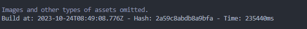
  - 现代浏览器打包结果
    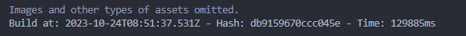

2. 第二次，得到了缓存优化
  - 兼容旧浏览器的输出结果：
    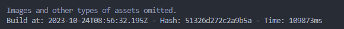
  - 现代浏览器打包结果
    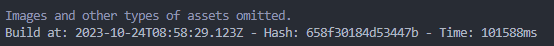

处理所有警告后：

1. 首次
  - 兼容旧浏览器的输出结果：
    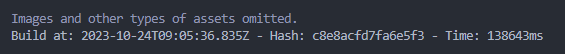
  - 现代浏览器打包结果
    

2. 第二次
  - 兼容旧浏览器的输出结果：
    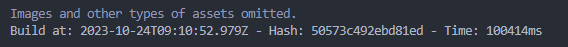
  - 现代浏览器打包结果
    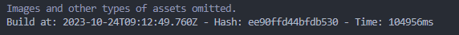

所有的警告对打包性能影响不大，接下来移除`_extend.scss`的所有非扩展样式：

1. 首次
  - 兼容旧浏览器的输出结果：
    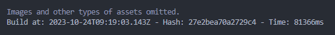
  - 现代浏览器打包结果
    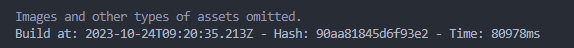

2. 第二次
  - 兼容旧浏览器的输出结果：
    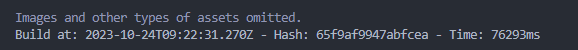
  - 现代浏览器打包结果
    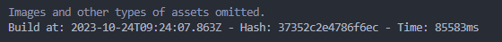

非扩展样式被全局处理的影响非常大，需要考虑移除。

使用`cdn`：

1. 首次
  - 兼容旧浏览器的输出结果：
    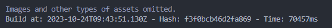
  - 现代浏览器打包结果
    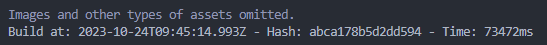

2. 第二次
  - 兼容旧浏览器的输出结果：
    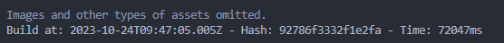
  - 现代浏览器打包结果
    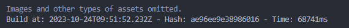

使用`cdn`独立模块不能说快了很多，至少也有一点作用。不常更新的模块独立出来，相对于很长的打包时间来说，是值得的。而且现在只是提取了部分模块，其他的模块继续提取的话效果会更显著。有一个缺点是：需要调试模块源码时不方便。

不再打包现代浏览器模块：

1. 首次

  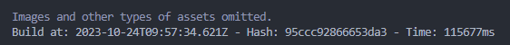

2. 第二次

  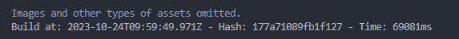

3. 第三次

  

独立不独立影响不大，但是相对打包两次来说，相当于时间减半了。建议在正式环境中使用，其他环境只打包现代浏览器或者只打包兼容旧浏览器的结果

## 优化完成后对比

- `beta`分支未优化前打包：

1. 首次
  - 兼容旧浏览器的输出结果：
    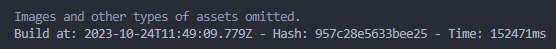
  - 现代浏览器打包结果
    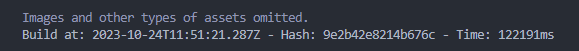

2. 第二次
  - 兼容旧浏览器的输出结果：
    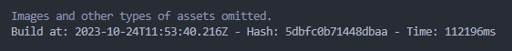
  - 现代浏览器打包结果
    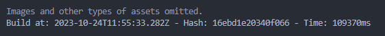

- `beta`分支优化后打包：

1. 首次
    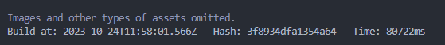

2. 第二次
    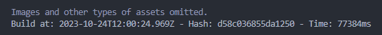


速度提高30s左右，连上现代浏览器的模块大概提高2min。

鉴于本项目模块本来就多，能压榨的时间较少了，可能需要从其他地方突破。

可以考虑：
- 提取更多模块到外部
- 使用速度更快的插件